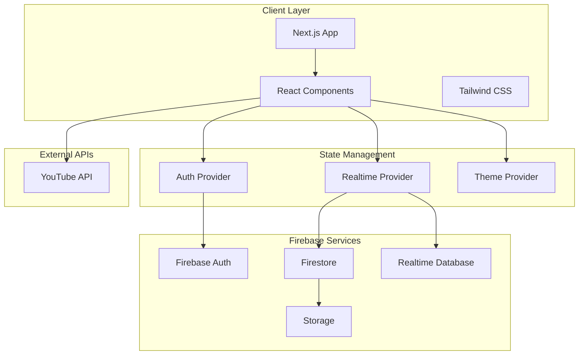
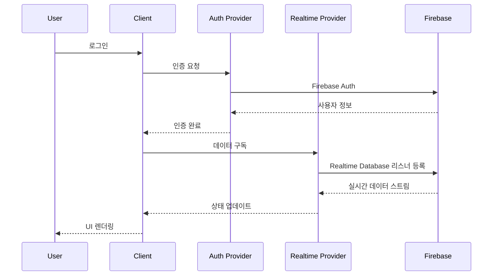

# Life Curriculum 프로그램 기획서

> **문서 버전**: 1.0  
> **작성일**: 2026-01-07  
> **대상**: 개발팀 내부 공유  
> **프로젝트명**: Life Curriculum - 통합 학습 관리 플랫폼

---

## 📋 목차

1. [프로젝트 개요](#프로젝트-개요)
2. [주요 기능 명세](#주요-기능-명세)
3. [기술 스택](#기술-스택)
4. [시스템 아키텍처](#시스템-아키텍처)
5. [사용자 역할 및 권한](#사용자-역할-및-권한)
6. [데이터 구조](#데이터-구조)
7. [주요 페이지 구성](#주요-페이지-구성)

---

## 프로젝트 개요

### 프로젝트 목적

**Life Curriculum**은 개인과 팀의 성장을 위한 통합 학습 관리 플랫폼입니다. 사용자가 자신만의 학습 커리큘럼을 생성하고, 팀 단위로 학습을 관리하며, 진행 상황을 추적할 수 있는 종합적인 학습 생태계를 제공합니다.

### 핵심 가치

- **개인화된 학습 경로**: 사용자가 자신의 목표에 맞는 커리큘럼을 직접 생성하고 관리
- **팀 협업 학습**: 팀 단위로 학습 목표를 설정하고 진행 상황을 공유
- **실시간 동기화**: Firebase 기반의 실시간 데이터 동기화로 즉각적인 피드백
- **YouTube 통합**: YouTube 영상을 활용한 효율적인 학습 콘텐츠 관리

### 주요 사용자

- **일반 사용자**: 개인 학습 목표를 관리하는 학습자
- **팀 리더**: 팀원들의 학습을 관리하고 모니터링하는 관리자
- **관리자**: 플랫폼 전체를 관리하고 콘텐츠를 승인하는 시스템 관리자

---

## 주요 기능 명세

### 1. 사용자 관리 (User Management)

#### 1.1 인증 및 권한

- **로그인/회원가입**: Firebase Authentication 기반
- **역할 기반 접근 제어 (RBAC)**:
  - `user`: 일반 사용자
  - `team_leader`: 팀 리더
  - `co_leader`: 부팀장
  - `admin`: 시스템 관리자
- **프로필 관리**: 사용자 정보, 아바타, 학습 통계 확인

#### 1.2 주요 컴포넌트

- [auth-provider.tsx](file:///Users/ichangjun/Documents/GitHub/v0-project/components/auth-provider.tsx): 인증 상태 관리
- [role-guard.tsx](file:///Users/ichangjun/Documents/GitHub/v0-project/components/role-guard.tsx): 권한 기반 접근 제어

---

### 2. 커리큘럼 관리 (Curriculum Management)

#### 2.1 커리큘럼 생성 및 편집

- **커리큘럼 생성**: 제목, 설명, 카테고리, 난이도, 예상 시간 설정
- **콘텐츠 추가**: YouTube 영상 URL을 통한 학습 콘텐츠 추가
- **진행 상황 추적**: 완료한 강의 수, 진행률 자동 계산
- **썸네일 자동 생성**: YouTube 영상의 썸네일 자동 추출

#### 2.2 커리큘럼 탐색

- **카테고리 필터링**: 기술, 비즈니스, 건강, 취미, 인문학, 언어
- **검색 기능**: 제목 및 설명 기반 검색
- **뷰 모드**: 리스트 뷰 / 그리드 뷰 전환
- **가져오기 기능**: 외부 커리큘럼 가져오기 (localStorage 기반)

#### 2.3 학습 진행

- **이어보기 기능**: 마지막 학습 위치에서 계속 진행
- **완료 체크**: 강의별 완료 상태 관리
- **진행률 시각화**: Progress Bar를 통한 시각적 피드백

#### 2.4 관련 파일

- [curriculum/page.tsx](file:///Users/ichangjun/Documents/GitHub/v0-project/app/curriculum/page.tsx): 커리큘럼 목록
- [curriculum/create/page.tsx](file:///Users/ichangjun/Documents/GitHub/v0-project/app/curriculum/create): 커리큘럼 생성
- [curriculum/[id]/page.tsx](file:///Users/ichangjun/Documents/GitHub/v0-project/app/curriculum/[id]): 커리큘럼 상세
- [youtube-utils.ts](file:///Users/ichangjun/Documents/GitHub/v0-project/lib/youtube-utils.ts): YouTube 썸네일 추출

---

### 3. 팀 관리 (Team Management)

#### 3.1 팀 대시보드

**통계 정보**:
- 팀원 수 (전체/활성)
- 평균 진도율
- 완료한 과정 수
- 총 학습 시간

**팀원 현황**:
- 팀원 목록 및 상태 (활성/비활성/대기)
- 개별 진행률 및 학습 시간
- 마지막 활동 시간
- 역할 및 태그 관리

#### 3.2 팀 기능

- **팀 생성**: 새로운 팀 생성
- **팀원 초대**: 초대 코드를 통한 팀원 추가
- **팀 커리큘럼**: 팀 전용 학습 커리큘럼 관리
- **공지사항**: 팀 내 공지사항 작성 및 공유
- **일정 관리**: 팀 학습 일정 관리
- **과제 관리**: 팀원에게 과제 할당 및 제출 관리
- **분석 보고서**: 팀 학습 통계 및 분석

#### 3.3 관련 페이지

- [team/dashboard/page.tsx](file:///Users/ichangjun/Documents/GitHub/v0-project/app/team/dashboard/page.tsx): 팀 대시보드
- [team/create/page.tsx](file:///Users/ichangjun/Documents/GitHub/v0-project/app/team/create): 팀 생성
- [team/invite/page.tsx](file:///Users/ichangjun/Documents/GitHub/v0-project/app/team/invite): 팀원 초대
- [team/join/[code]/page.tsx](file:///Users/ichangjun/Documents/GitHub/v0-project/app/team/join/[code]): 팀 가입
- [team/members/page.tsx](file:///Users/ichangjun/Documents/GitHub/v0-project/app/team/members): 팀원 관리
- [team/curriculum/page.tsx](file:///Users/ichangjun/Documents/GitHub/v0-project/app/team/curriculum): 팀 커리큘럼
- [team/announcements/page.tsx](file:///Users/ichangjun/Documents/GitHub/v0-project/app/team/announcements): 공지사항
- [team/schedule/page.tsx](file:///Users/ichangjun/Documents/GitHub/v0-project/app/team/schedule): 일정 관리
- [team/assignments/page.tsx](file:///Users/ichangjun/Documents/GitHub/v0-project/app/team/assignments): 과제 관리
- [team/analytics/page.tsx](file:///Users/ichangjun/Documents/GitHub/v0-project/app/team/analytics): 분석 보고서

---

### 4. 관리자 패널 (Admin Panel)

#### 4.1 플랫폼 통계

- **사용자 통계**: 전체 사용자 수, 활성 사용자 수
- **커리큘럼 통계**: 전체 커리큘럼 수, 승인 대기 수
- **학습 통계**: 총 학습 시간, 월별 증가율
- **시스템 상태**: 시스템 헬스 체크, 서버 상태 모니터링

#### 4.2 관리 기능

- **사용자 관리**: 사용자 목록, 권한 관리, 계정 상태 관리
- **콘텐츠 승인**: 커리큘럼 승인/거부
- **분석 보고서**: 플랫폼 전체 사용 통계 및 분석
- **시스템 설정**: 플랫폼 설정 관리

#### 4.3 시스템 모니터링

- 웹 서버 상태
- 데이터베이스 상태
- CDN 상태
- 백업 시스템 상태

#### 4.4 관련 페이지

- [admin/dashboard/page.tsx](file:///Users/ichangjun/Documents/GitHub/v0-project/app/admin/dashboard/page.tsx): 관리자 대시보드
- [admin/users/page.tsx](file:///Users/ichangjun/Documents/GitHub/v0-project/app/admin/users): 사용자 관리
- [admin/content/page.tsx](file:///Users/ichangjun/Documents/GitHub/v0-project/app/admin/content): 콘텐츠 승인
- [admin/analytics/page.tsx](file:///Users/ichangjun/Documents/GitHub/v0-project/app/admin/analytics): 분석 보고서

---

### 5. 커뮤니티 (Community)

- **커리큘럼 공유**: 사용자가 만든 커리큘럼을 커뮤니티에 공유
- **좋아요 및 댓글**: 공유된 커리큘럼에 대한 피드백
- **인기 커리큘럼**: 좋아요 수 기반 인기 커리큘럼 표시

#### 관련 페이지

- [community/page.tsx](file:///Users/ichangjun/Documents/GitHub/v0-project/app/community/page.tsx): 커뮤니티 메인

---

### 6. 대시보드 (Dashboard)

#### 6.1 개인 대시보드

**학습 통계**:
- 완료한 강의 수
- 이번 주 학습 시간
- 진행 중인 커리큘럼 수

**내 커리큘럼**:
- 진행 중인 커리큘럼 목록 (최대 4개)
- 진행률 표시
- 이어보기 기능

**알림**:
- 읽지 않은 알림 수 표시
- 실시간 알림 업데이트

#### 6.2 관련 파일

- [page.tsx](file:///Users/ichangjun/Documents/GitHub/v0-project/app/page.tsx): 메인 대시보드

---

### 7. 기타 기능

#### 7.1 실시간 동기화

- **Realtime Provider**: Firebase Realtime Database를 통한 실시간 데이터 동기화
- **자동 업데이트**: 커리큘럼, 알림 등 실시간 반영

#### 7.2 테마 및 UI

- **다크/라이트 모드**: 사용자 선택 가능한 테마
- **반응형 디자인**: 모바일, 태블릿, 데스크톱 지원
- **Radix UI 컴포넌트**: 접근성이 높은 UI 컴포넌트 사용

#### 7.3 관련 컴포넌트

- [realtime-provider.tsx](file:///Users/ichangjun/Documents/GitHub/v0-project/components/realtime-provider.tsx): 실시간 데이터 동기화
- [theme-provider.tsx](file:///Users/ichangjun/Documents/GitHub/v0-project/components/theme-provider.tsx): 테마 관리
- [mode-switcher.tsx](file:///Users/ichangjun/Documents/GitHub/v0-project/components/mode-switcher.tsx): 모드 전환

---

## 기술 스택

### Frontend

| 기술 | 버전 | 용도 |
|------|------|------|
| **Next.js** | 15.1.11 | React 프레임워크, SSR/SSG |
| **React** | 19.0.0 | UI 라이브러리 |
| **TypeScript** | 5.6.3 | 타입 안정성 |
| **Tailwind CSS** | 4.1.9 | 스타일링 |
| **Radix UI** | - | 접근성 높은 UI 컴포넌트 |
| **Lucide React** | 0.468.0 | 아이콘 |
| **Recharts** | 2.13.3 | 차트 및 데이터 시각화 |

### Backend & Database

| 기술 | 용도 |
|------|------|
| **Firebase** | 인증, 실시간 데이터베이스, 스토리지 |
| **Firebase Authentication** | 사용자 인증 |
| **Firebase Realtime Database** | 실시간 데이터 동기화 |
| **Firebase Firestore** | 문서 기반 데이터베이스 |

### Development Tools

| 도구 | 용도 |
|------|------|
| **ESLint** | 코드 품질 관리 |
| **PostCSS** | CSS 처리 |
| **pnpm** | 패키지 관리자 |

---

## 시스템 아키텍처

### 전체 구조



### 데이터 흐름



---

## 사용자 역할 및 권한

### 역할 정의

| 역할 | 권한 | 접근 가능 페이지 |
|------|------|------------------|
| **user** | - 개인 커리큘럼 생성/수정/삭제<br>- 학습 진행 추적<br>- 커뮤니티 참여 | - 대시보드<br>- 커리큘럼<br>- 프로필<br>- 커뮤니티 |
| **team_leader** | - user 권한 전체<br>- 팀 생성/관리<br>- 팀원 초대<br>- 팀 커리큘럼 관리<br>- 과제 할당 | - user 페이지 전체<br>- 팀 대시보드<br>- 팀 관리 페이지 |
| **co_leader** | - user 권한 전체<br>- 팀 관리 일부 권한 | - user 페이지 전체<br>- 팀 대시보드 (제한적) |
| **admin** | - 전체 시스템 관리<br>- 사용자 관리<br>- 콘텐츠 승인<br>- 시스템 설정 | - 전체 페이지<br>- 관리자 패널 |

### 권한 구현

- **RoleGuard 컴포넌트**: 페이지 레벨 권한 체크
- **조건부 렌더링**: 역할에 따른 UI 요소 표시/숨김

---

## 데이터 구조

### 주요 데이터 모델

#### Curriculum (커리큘럼)

```typescript
interface Curriculum {
  id: string
  title: string
  description: string
  category: string // 기술, 비즈니스, 건강, 취미, 인문학, 언어
  level: string // 초급, 중급, 고급
  progress: number // 0-100
  totalLessons: number
  completedLessons: number
  estimatedHours: number
  thumbnail?: string
  isPublic: boolean
  likes: number
  students: number
  contents: Content[]
  createdAt: Date
  updatedAt: Date
  userId: string
}
```

#### Content (콘텐츠)

```typescript
interface Content {
  id: string
  videoId: string // YouTube Video ID
  title: string
  duration: number
  completed: boolean
  order: number
}
```

#### User (사용자)

```typescript
interface User {
  id: string
  name: string
  email: string
  avatar?: string
  role: 'user' | 'team_leader' | 'co_leader' | 'admin'
  createdAt: Date
  lastActive: Date
}
```

#### Team (팀)

```typescript
interface Team {
  id: string
  name: string
  description: string
  leaderId: string
  members: TeamMember[]
  inviteCode: string
  createdAt: Date
}
```

#### TeamMember (팀원)

```typescript
interface TeamMember {
  id: string
  name: string
  email: string
  avatar?: string
  role: 'member' | 'co_leader'
  joinedAt: Date
  progress: number
  completedCourses: number
  totalLearningHours: number
  lastActive: Date
  status: 'active' | 'inactive' | 'pending'
  tags: string[]
  position?: string
  expertise?: string[]
}
```

---

## 주요 페이지 구성

### 페이지 맵

```
/                           # 메인 대시보드
├── /login                  # 로그인
├── /profile                # 프로필
├── /settings               # 설정
├── /progress               # 학습 진행 상황
│
├── /curriculum             # 커리큘럼 목록
│   ├── /create             # 커리큘럼 생성
│   └── /[id]               # 커리큘럼 상세
│
├── /community              # 커뮤니티
├── /explore                # 탐색
│
├── /team                   # 팀 관리
│   ├── /create             # 팀 생성
│   ├── /dashboard          # 팀 대시보드
│   ├── /invite             # 팀원 초대
│   ├── /join/[code]        # 팀 가입
│   ├── /members            # 팀원 관리
│   ├── /curriculum         # 팀 커리큘럼
│   ├── /announcements      # 공지사항
│   ├── /schedule           # 일정 관리
│   ├── /assignments        # 과제 관리
│   ├── /review             # 과제 검토
│   ├── /notifications      # 알림
│   ├── /analytics          # 분석 보고서
│   └── /settings           # 팀 설정
│
└── /admin                  # 관리자 패널
    ├── /dashboard          # 관리자 대시보드
    ├── /users              # 사용자 관리
    ├── /content            # 콘텐츠 승인
    └── /analytics          # 분석 보고서
```

### 라우팅 구조

- **동적 라우팅**: `[id]`, `[code]` 등을 활용한 동적 페이지
- **중첩 라우팅**: Next.js App Router의 폴더 기반 라우팅
- **보호된 라우팅**: RoleGuard를 통한 권한 기반 접근 제어

---

## 핵심 컴포넌트

### UI 컴포넌트 (components/ui)

- `button.tsx`: 버튼 컴포넌트
- `card.tsx`: 카드 컴포넌트
- `progress.tsx`: 진행률 바
- `badge.tsx`: 배지
- `avatar.tsx`: 아바타
- `input.tsx`: 입력 필드
- `dialog.tsx`: 다이얼로그
- `toast.tsx`: 토스트 알림
- `tabs.tsx`: 탭
- `select.tsx`: 셀렉트
- `checkbox.tsx`: 체크박스
- `switch.tsx`: 스위치
- `tooltip.tsx`: 툴팁

### 기능 컴포넌트 (components)

- [auth-provider.tsx](file:///Users/ichangjun/Documents/GitHub/v0-project/components/auth-provider.tsx): 인증 상태 관리
- [realtime-provider.tsx](file:///Users/ichangjun/Documents/GitHub/v0-project/components/realtime-provider.tsx): 실시간 데이터 동기화
- [role-guard.tsx](file:///Users/ichangjun/Documents/GitHub/v0-project/components/role-guard.tsx): 권한 기반 접근 제어
- [theme-provider.tsx](file:///Users/ichangjun/Documents/GitHub/v0-project/components/theme-provider.tsx): 테마 관리
- [mode-switcher.tsx](file:///Users/ichangjun/Documents/GitHub/v0-project/components/mode-switcher.tsx): 모드 전환
- [progress-tracker.tsx](file:///Users/ichangjun/Documents/GitHub/v0-project/components/progress-tracker.tsx): 진행 상황 추적
- [admin-nav.tsx](file:///Users/ichangjun/Documents/GitHub/v0-project/components/admin-nav.tsx): 관리자 네비게이션

---

## 개발 가이드

### 로컬 개발 환경 설정

```bash
# 패키지 설치
pnpm install

# 개발 서버 실행
pnpm dev

# 빌드
pnpm build

# 프로덕션 서버 실행
pnpm start

# 린트 검사
pnpm lint
```

### Firebase 설정

1. Firebase 프로젝트 생성
2. Authentication, Firestore, Realtime Database 활성화
3. 환경 변수 설정 (`.env.local`)

```env
NEXT_PUBLIC_FIREBASE_API_KEY=your_api_key
NEXT_PUBLIC_FIREBASE_AUTH_DOMAIN=your_auth_domain
NEXT_PUBLIC_FIREBASE_PROJECT_ID=your_project_id
NEXT_PUBLIC_FIREBASE_STORAGE_BUCKET=your_storage_bucket
NEXT_PUBLIC_FIREBASE_MESSAGING_SENDER_ID=your_sender_id
NEXT_PUBLIC_FIREBASE_APP_ID=your_app_id
```

---

## 향후 개선 사항

### 단기 목표

- [ ] 과제 제출 및 검토 기능 고도화
- [ ] 실시간 채팅 기능 추가
- [ ] 학습 통계 대시보드 개선
- [ ] 모바일 앱 개발 (React Native)

### 장기 목표

- [ ] AI 기반 학습 추천 시스템
- [ ] 게임화 요소 추가 (배지, 레벨, 리더보드)
- [ ] 다국어 지원
- [ ] 오프라인 학습 지원
- [ ] 화상 회의 통합

---

## 참고 자료

- [Next.js 공식 문서](https://nextjs.org/docs)
- [Firebase 공식 문서](https://firebase.google.com/docs)
- [Tailwind CSS 공식 문서](https://tailwindcss.com/docs)
- [Radix UI 공식 문서](https://www.radix-ui.com/docs)

---

**문서 작성자**: Antigravity AI  
**최종 수정일**: 2026-01-07
